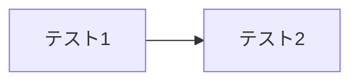

+++
title = "記法のテスト"
date = "2025-12-29T01:19:49+09:00"
draft = false
tags = []
+++

まずはテーブル

| カラム1 | カラム２ | カラム3 |
| ---- | ---- | ---- |
| A    | B    | C    |

次はコードブロック
```
"Hello World"
```

次はマーメード図



次は見出し
#あいうえお
## あいうえお
### あいうえお
#### あいうえお
##### あいうえお

次はリスト
- あいうえお
	- あいうえお
		- あいうえお
1. あいうえお
2. あいうえお
3. あいうえお
	1. あいうえお
		1. かきくけこ

さて、どうなる